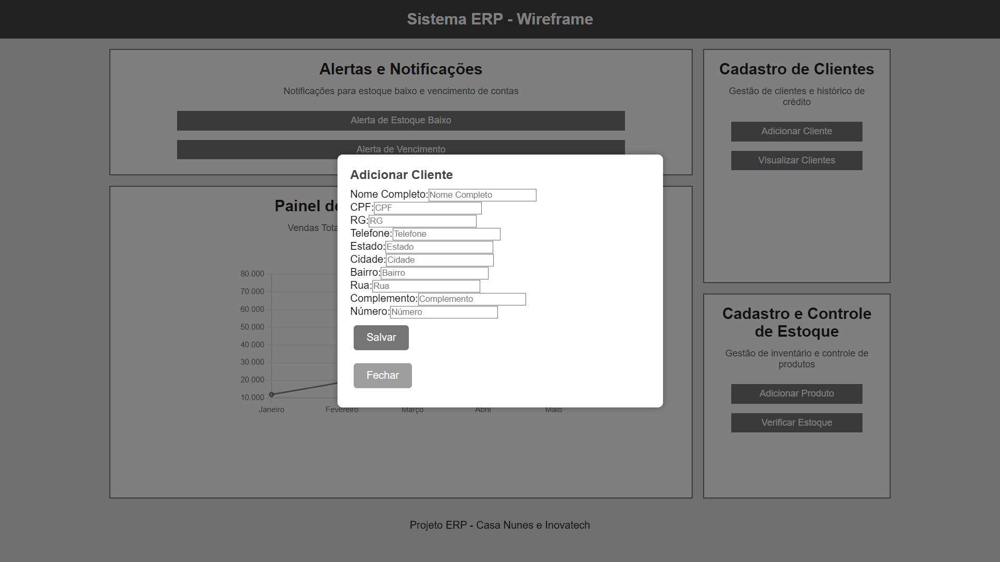
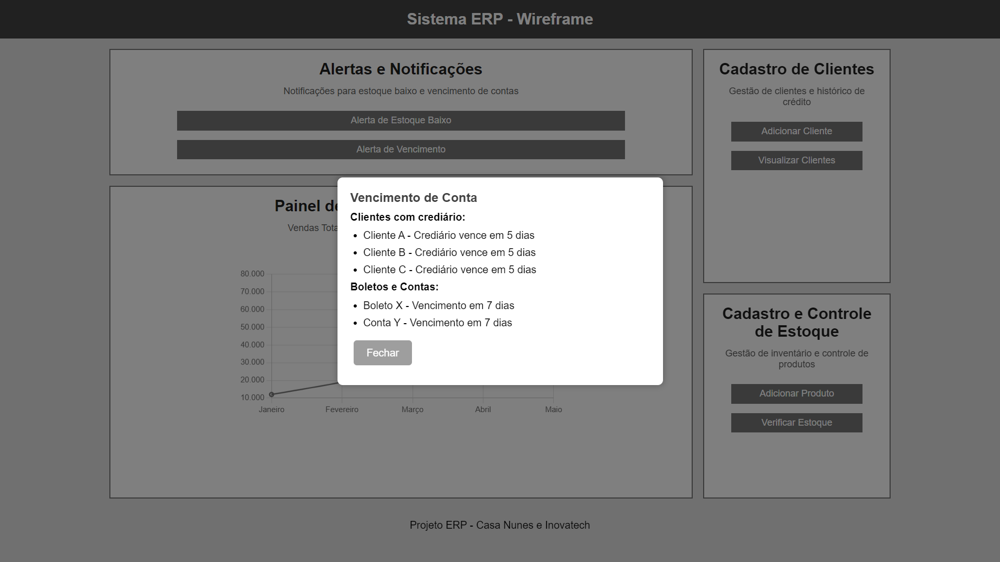
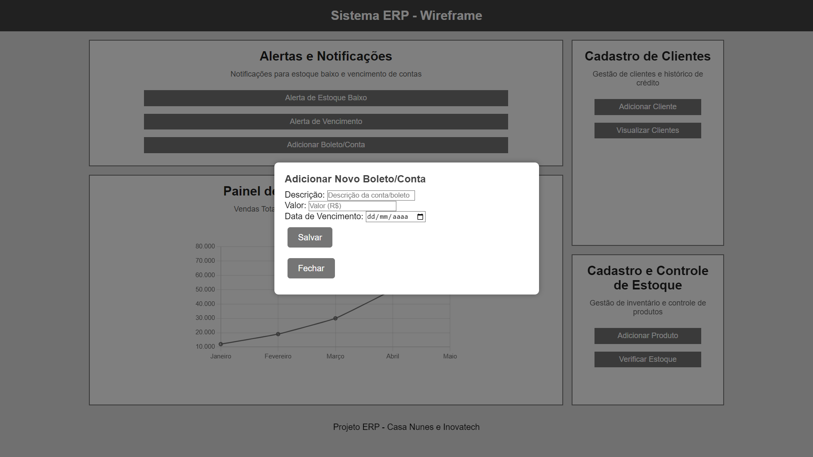

# Inovatech - Sistema de Gestão Empresarial

   

 Figura 1 - Logo da Casa Nunes

# Visão Geral
## O Desafio
Desenvolver um sistema intuitivo e moderno que atenda às necessidades de uma gestão empresarial completa. O sistema tem como foco principal gerenciar clientes, produtos, pagamentos e estoque de forma otimizada.

## Contexto
A Casa Nunes, uma empresa com forte atuação no mercado local, enfrenta desafios na gestão de suas operações devido ao uso de sistemas antiquados e pouco adaptados às suas necessidades. O sistema anterior não possui recursos modernos, como alertas de estoque e notificações de pagamentos, e não reflete a identidade visual da empresa. Este projeto visa solucionar esses problemas, otimizando o fluxo de trabalho e aumentando a produtividade.

# WHY?
## Quem utilizará o sistema?
Após reuniões com a equipe da Casa Nunes, identificamos que o sistema será utilizado principalmente por administradores e gerentes, que necessitam de ferramentas práticas para gerenciar clientes, estoque e fluxo de caixa.

### Quais seriam os problemas?
- Interface desatualizada e pouco funcional.
- Falta de notificações automatizadas para estoques baixos e pagamentos pendentes.
- Funcionalidades essenciais ausentes, como cadastro eficiente de produtos e clientes.
- Falta de relatórios para análise de desempenho.

# WHO?
## Persona
Criamos esta persona para representar o gerente da empresa, evidenciando suas dores e necessidades em relação à gestão empresarial.

   

 Figura 2 - Persona criada para representar o gerente.

## Mapa de Empatia
Para compreender melhor as necessidades dos usuários, desenvolvemos um mapa de empatia que destaca os pensamentos e sentimentos do usuário principal.

   

 Figura 3 - Mapa de Empatia

# Requisitos
**1. Interface visual moderna e intuitiva:**
- Adotar cores alinhadas com a identidade visual da empresa.
- Criar um design responsivo para desktop e dispositivos móveis.

**2. Funcionalidades adicionais:**
- Alertas automáticos para estoques baixos.
- Notificações para pagamentos pendentes.
- Cadastro detalhado de produtos e clientes.

**3. Relatórios gerenciais:**
- Relatórios de estoque.
- Relatórios financeiros e de vendas.

**4. Segurança:**
- Backup automático e funcionalidade de restauração.

# Identidade Visual
A identidade visual foi desenvolvida com base nas cores e estilo da Casa Nunes, destacando tons que refletem a marca de forma moderna e profissional.

   

 Figura 4 - Identidade Visual

# Wireframes

### Prototipação
Os wireframes foram criados para demonstrar o fluxo principal do sistema, incluindo as telas de login, dashboard, e gestão de clientes e produtos.

#### Tela Principal

Figura 5 - Tela Principal: Exibe uma visão centralizada do sistema, permitindo acesso rápido a informações críticas como status do estoque, desempenho de vendas e notificações sobre clientes e vencimentos. O gráfico de vendas oferece uma análise de tendências mensais.

#### Lista de Clientes

Figura 6 - Gestão de Clientes: Apresenta todos os clientes cadastrados com filtros de busca para localizar rapidamente registros específicos. Permite também visualizar ou editar informações de cada cliente, incluindo crediário.

#### Cadastro de Novo Cliente

Figura 7 - Cadastro de Novo Cliente: Um formulário estruturado para coleta de informações completas dos clientes, como dados pessoais, contato e endereço. Inclui validação para evitar duplicidade de informações e inconsistências.

#### Cadastro de Novo Produto

Figura 8 - Cadastro de Novo Produto: Tela para registrar produtos no sistema, incluindo detalhes como nome, código, categoria, quantidade em estoque, preço e fornecedor. Possui campos opcionais para alertas automáticos em casos de estoque mínimo.

#### Estoque

Figura 9 - Estoque: Fornece um panorama geral do inventário com a quantidade atual de cada produto. Apresenta destaque visual para itens com baixa disponibilidade e permite acesso rápido para reposição ou ajustes.

#### Notificações de Pagamentos

Figura 10 - Notificações: Mostra alertas detalhados sobre vencimentos futuros ou atrasos de pagamentos, permitindo que os administradores priorizem ações financeiras e mantenham a saúde do fluxo de caixa.

#### Adicionar Novo Boleto/Conta

Figura 11 - Adicionar Novo Boleto/Conta: Formulário que permite a inserção de novas contas ou boletos, incluindo descrição, valor e data de vencimento. Essa funcionalidade possibilita manter um controle atualizado e centralizado das contas a pagar.

#### Alerta de Estoque Baixo

Figura 12 - Alerta de Estoque: Lista produtos com níveis críticos de estoque, ordenados por prioridade. Inclui links diretos para ações de reposição, facilitando a tomada de decisão em tempo real.

# Protótipo de Alta Fidelidade
Os protótipos de alta fidelidade foram criados para oferecer uma visualização clara de como o sistema será implementado. Acesse os protótipos abaixo:
- [Wireframe Inicial](https://github.com/BAttomic/Inovatech/raw/main/assets/Wireframe/inicial.html)
- [Interface Intermediária](https://github.com/BAttomic/Inovatech/raw/main/assets/Wireframe/intermediario.html)
- [Prototipação Final](https://github.com/BAttomic/Inovatech/raw/main/assets/Wireframe/alta.html)

# Documentação
Os seguintes documentos detalham o processo de desenvolvimento e reuniões realizadas:
- [Formação da Empresa](https://github.com/BAttomic/Inovatech/raw/main/assets/Contratos/Formacao_de_Empresa.pdf)
- [Termo de Aceite do Projeto](https://github.com/BAttomic/Inovatech/raw/main/assets/Contratos/Termo_de_Aceite_do_Projeto.pdf)

## Reuniões de Sprint
- [Ata Sprint 1](https://github.com/BAttomic/Inovatech/raw/main/assets/Reuniões/Ata_Sprint_1.pdf)
- [Ata Sprint 2](https://github.com/BAttomic/Inovatech/raw/main/assets/Reuniões/Ata_Sprint_2.pdf)
- [Ata Sprint 3](https://github.com/BAttomic/Inovatech/raw/main/assets/Reuniões/Ata_Sprint_3.pdf)
- [Ata Sprint 4](https://github.com/BAttomic/Inovatech/raw/main/assets/Reuniões/Ata_Sprint_4.pdf)
- [Ata Sprint 5](https://github.com/BAttomic/Inovatech/raw/main/assets/Reuniões/Ata_Sprint_5.pdf)

# Conclusão
Este projeto foi desenvolvido com o objetivo de criar uma solução eficiente e moderna para a gestão empresarial. O trabalho colaborativo da equipe Inovatech garantiu uma solução funcional e alinhada às necessidades dos usuários.

# Colaboradores do Projeto
<table>
  <tr>
    <td align="center">
      
       
      <b>Samuel Henrique de Amorim</b>
    </td>
    <td align="center">
      
       
      <b>Bernardo Cordeiro Motta</b>
    </td>
    <td align="center">
      
       
      <b>Artur da Silva Coelho</b>
    </td>
  </tr>
</table>
